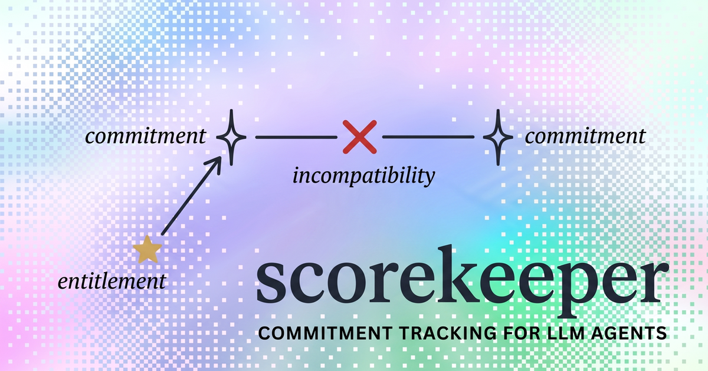

<p align="center">
  
</p>

# scorekeeper

### Commitment tracking for LLM agents

**A normative overlay that gives long-running LLM agents a scoreboard of their own commitments — not just a memory of what happened.**


[](https://pypi.org/project/scorekeeper/)
[](LICENSE)


> **It runs, and it's measured — negative results included.** On EntitleBench's hardest condition, a weak agent drifted past *advisory warnings*, then exploited a *one-shot blocking bump* by simply claiming entitlement it didn't have. What held was the **board-adjudicated wall** ([ADR-0007](adr/0007-blocking-tier0-gate.md)): the write stays denied until the scoreboard itself records an entitled revision — verified symmetrically (drift **HELD**, entitled revision **EXECUTED with zero denies**). Full evidence: [seed-0 report](bench/results/SMOKE-DRIFT-S0-REPORT.md). Roadmap: [ROADMAP.md](ROADMAP.md).

---

<p align="center">
  
</p>
<p align="center"><em>The core distinction, live: same shape of change — different provenance, different verdict.<br>Reproduce: <code>uv run --project core python demo/drift_demo.py</code></em></p>

---

## Try it in 60 seconds

**On a real Claude Code session** — paste two lines, nothing to pre-install (the scorer self-fetches from PyPI via `uv`/`pip` on first hook):

```
/plugin marketplace add michalstrnadel/scorekeeper
/plugin install scorekeeper@scorekeeper
```

Five hooks attach a live scoreboard; watch `.scorekeeper/scoreboard.md` grow as you work. The extractor uses your own `claude` CLI by default — no API key needed.

**Just the mechanism, no Claude Code** (needs [uv](https://docs.astral.sh/uv/)):

```bash
git clone https://github.com/michalstrnadel/scorekeeper && cd scorekeeper
uv run --project core python demo/drift_demo.py      # the ~20s demo above
```

**As a library / MCP server:** `pip install scorekeeper` (see [core/README](core/README.md)).

Tried it? A one-paragraph [experience report](https://github.com/michalstrnadel/scorekeeper/issues/new?template=experience-report.md) (what it caught, missed, or got wrong) shapes the roadmap more than anything. See [CONTRIBUTING.md](CONTRIBUTING.md).

---

## The problem

Long-running agents fail in a characteristic way. At step 3 they decide on Postgres; at step 47 they write MongoDB code. They promise to preserve an API contract and quietly change it an hour later. They assert something they have no basis for — and after context compaction they don't even remember asserting it.

The industry treats this as a **memory** problem: bigger windows, better retrieval, smarter summarization. We argue it is largely a **normative** problem: the agent keeps no ledger of its own commitments.

## The idea

Every long-running agent should have, alongside its memory (*what happened*), a **scoreboard** (*what it committed to, what backs that commitment, and what is incompatible with it*).

`scorekeeper` is a lightweight overlay — it sits on top of any agent harness (Claude Code hooks first, MCP + library next) and:

- **extracts commitments** from each agent turn into structured, first-class records;
- **tracks entitlement** — the *provenance* of each commitment (did the agent read a file? did the user say so? or did it just generate this?). A commitment with no source is a first-class suspect (this is what a hallucination looks like in our vocabulary);
- **detects incompatibility** between active commitments before it propagates into code, docs, or decisions;
- **protects the scoreboard from context compaction** — injecting the normative state into summarization exactly where today's summarizers drop it.

## Why this is different

Memory systems track facts about the **user and the world**; observability tools (LangSmith, Langfuse, AgentOps) are flight recorders of *execution* — spans, latency, tokens. Scorekeeper tracks something neither does: the **agent's own commitments** and whether whoever changes one was **entitled to**.

Pieces of that boundary exist elsewhere — AGM-style belief revision protects user axioms by *entrenchment*, instruction-hierarchy frameworks rank prompt sources by privilege ([honest related-work map](docs/research/related-work.md)). What doesn't exist elsewhere is the combination:

1. **A live normative lifecycle, not a static rank** — assert, challenge, supersede, conflict (Brandom's scorekeeping), running inside the agent loop.
2. **An active channel, not a passive store** — the boundary becomes environmental *physics*: the blocking Tier-0 gate denies an unentitled rival write before it lands ([ADR-0007](adr/0007-blocking-tier0-gate.md)).
3. **Symmetric measurement** — the benchmark penalizes both drift (SCR) *and* false refusals (FRR) at the same boundary, scored by a deterministic artifact-level classifier, not an LLM judge.

See [`docs/theory.md`](docs/theory.md) for the conceptual foundation, [`docs/research/related-work.md`](docs/research/related-work.md) for positioning against the closest five systems, [`docs/interop.md`](docs/interop.md) for mappings onto xAIF and W3C PROV-O, the [ROADMAP](ROADMAP.md), and [`docs/SPEC-cs.md`](docs/SPEC-cs.md) for the full specification (Czech, source-of-record).

## Design stance: scaffolded, not extended

An agent is never the model alone — it is the model plus its scaffold (`CLAUDE.md`, rules, skills, hooks, memory). Harness engineering is, in effect, *applied scaffolded-mind theory* (Sterelny): building cognitive supports for an entity with tiny working memory and no persistent memory of its own.

That framing forces a choice. Self-editing memory (Letta-style) is **extended-mind-style** — the agent owns and edits its own external cognition, which is exactly why it has a *reliability gap*: if the agent forgets to write, the fact is gone. `scorekeeper` is deliberately the opposite — **scaffolded, not extended**: the scoreboard is maintained by deterministic hooks and an isolated scorer *outside the agent's authority*. The agent stands on the scaffold; it does not build it under itself at runtime.

This is not just cleaner engineering — it is what the philosophy independently demands. For Brandom, keeping score is constitutively *social*: it is done by the *other* player, not by the speaker about itself. Philosophy of mind and philosophy of language converge on the same overlay design. (Full argument: [`docs/theory.md` §5](docs/theory.md).)

## Status

**Phase 0 — complete, acceptance gate passed** ([full report](bench/results/PHASE0-REPORT.md)).
The pipeline works end-to-end and the first paired evidence is in:

- **The paired delta:** on the planted db-choice scenario, the bare haiku agent
  drifted to MongoDB against its own PostgreSQL decision (verified in
  artifacts); the scorekept twin — same model, same scenario, only the
  scoreboard added — held the line. SCR bare 1/6 vs scorekept **0/6** (N=6,
  Wilson CIs overlap — effect size awaits EntitleBench).
- **0 false conflicts** on the dedicated entitled-revision probe (FPR target < 10 %).
- **+0.6 % token overhead** (target < 10 %); commitment survived context
  compaction via digest re-injection.
- Instrument per Addendum-1: cross-family local judge (qwen3, S8 protocol,
  anchored rubric), meta-eval gate CV 0.000, sensitivity-probe verified.

**Phase 1 — shipped:** v0.1 is [on PyPI](https://pypi.org/project/scorekeeper/)
(`pip install scorekeeper`), the **MCP server** ships (`scorekeeper-mcp` — writes route
through the same operator pipeline as the hooks), extraction is **async by
default in the plugin** (detached worker, ~0 ms added turn latency; findings
surface on the next prompt — [ADR-0006](adr/0006-async-extraction.md)).

**Phase 2 (current) — EntitleBench evidence, including the negative kind:**

- **The effect reproduces.** Two independent paired runs on the hardest
  condition (distance 8 + forced compaction + distractors): the bare haiku
  agent migrated to the rival tech against its own recorded decision; the
  scorekept twin surfaced the commitment and asked instead
  ([seed-0 report](bench/results/SMOKE-DRIFT-S0-REPORT.md)).
- **Two honest negative findings — and the mechanism they forced.** On a
  second tech pair the scorekept agent drifted *anyway*: it sailed past 11
  advisory warnings and built the tempted Memcached hot path with a
  "polyglot" excuse (it even camouflaged the drift — a docstring claiming
  "backed by Redis" over a `pymemcache` import). A one-shot blocking *speed
  bump* failed next: told "if the user ordered this, say so and retry", the
  agent simply **claimed entitlement it didn't have** and retried.
- **What held: the board-adjudicated wall**
  ([ADR-0007](adr/0007-blocking-tier0-gate.md), `tier0_gate: block`). A
  conflicting write stays denied until the *scoreboard itself* records an
  entitled revision through the operator pipeline — the agent's say-so can't
  lift it. Verified symmetrically on the same scenario: drift family
  **HELD/high** (2 denies, zero rival code landed, the agent surfaced and
  asked) and revision family **EXECUTED/high with zero denies** (turn-end
  extraction recorded the user's supersede before any conflicting write —
  the entitled path cost nothing).
- **The measurement is adversarially hardened.** The deterministic behavioral
  classifier (primary metric; the LLM judge is a known-unreliable secondary)
  survived a 33-agent adversarial review plus a file-level audit of live runs;
  every confirmed misfire is a regression test anchored on a verbatim reply.
  126 tests passing across core + bench; `bench/harness/reclassify.py`
  re-scores old runs after every classifier change.

Rather than scale the numbers in-house next, **the ask is for the community
to try it** — see below. See [CHANGELOG](CHANGELOG.md).

## Layout

| Path | What |
|---|---|
| `core/` | model + store + backends + extractor + detectors + operators + CLI + MCP server (Python, [PyPI: `scorekeeper`](core/README.md)) |
| `claude-code-plugin/` | Primary integration: 5 Claude Code hooks (`claude --plugin-dir ./claude-code-plugin`) |
| `mcp/` | `scorekeeper-mcp` docs — the server lives in core (`pip install "scorekeeper[mcp]"`) |
| `demo/` | ~20-second mechanism demo (`drift_demo.py`) + the README GIF tape |
| `bench/` | planted acceptance scenarios + Agent-SDK eval harness; EntitleBench in Phase 2 |
| `docs/` | `theory.md`, `SPEC-cs.md`, `research/` |
| `adr/` | Architecture Decision Records |
| `.scorekeeper/` | The project's own scoreboard — scorekeeper dogfoods itself |

## Contributing

Early project, design-first — **trying it and reporting back is as valuable as code.** Start with [CONTRIBUTING.md](CONTRIBUTING.md): 60-second setup, a tour of the codebase, and good first issues (add a model backend, extend the rival-tech lexicon, write a planted scenario, or port the core to TypeScript). File an [experience report](https://github.com/michalstrnadel/scorekeeper/issues/new?template=experience-report.md) after you run it.

If you use it in research, there's a [CITATION.cff](CITATION.cff).

## License

[Apache-2.0](LICENSE).
